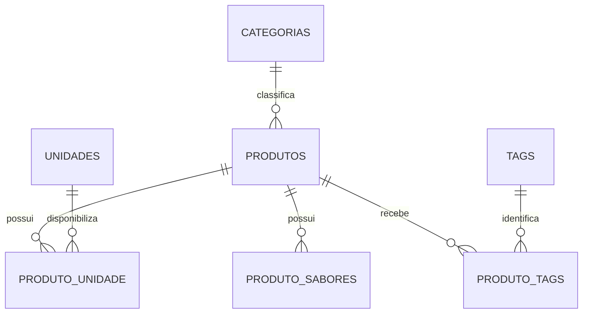
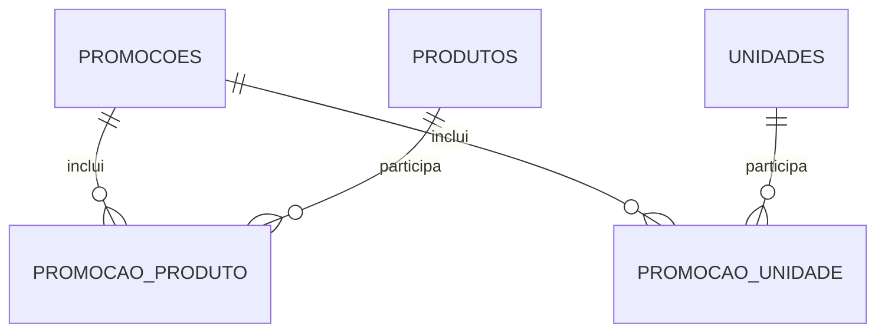

# Modelo corrigido — Dolce Delícias

A migration `001_schema.up.sql` é a definição executável dos tipos, chaves, índices, checks e triggers. O MER original misturava relacionamentos conceituais sem FKs correspondentes. A implementação corrige esses pontos:

| Ponto do desenho | Implementação |
|---|---|
| Usuário gerencia produto/unidade/promoção | `criado_por` e `atualizado_por`, ambas FKs opcionais para usuários, com `ON DELETE SET NULL` |
| Produto pertence a categoria | `produtos.id_categoria NOT NULL`, FK obrigatória |
| Unidade recebe promoção_produto | Ligação removida; a unidade participa por `promocao_unidade` |
| Produto_unidade participa de promoção_unidade | Ligação removida; a oferta efetiva é a interseção dos três vínculos |
| `senha` | `senha_hash`, gerado por `password_hash` e verificado por `password_verify` |
| Desconto sem limite superior | Percentual de 0 a 100, valor fixo não negativo |
| Datas livres | Final nunca anterior ao início; campos coerentes com agenda |
| Dia/mês singular | Arrays de inteiros limitados, preservando campanhas multimestre existentes |
| Mais de uma matriz | Índice parcial único sobre `tipo_unidade='MATRIZ'` |
| Nenhuma matriz ativa | Trigger diferida obriga uma matriz ativa enquanto a rede tiver registros |

## Catálogo e disponibilidade

## Promoções

Não há FK entre as duas associações de promoção. Para uma oferta valer para um produto em uma unidade, deve haver vínculo em `promocao_produto`, vínculo em `promocao_unidade` e disponibilidade em `produto_unidade`, além de status e linha compatíveis.

## Agenda

| Tipo | Campos |
|---|---|
| SEMANAL | Um ou mais `dias_semana` (0–6), `meses` vazio, datas opcionais |
| MENSAL | Um ou mais `meses` (1–12), `dias_semana` vazio, datas opcionais |
| PERIODO | Arrays vazios, pelo menos um limite de data |
| SEMPRE | Arrays vazios, sem datas |

Todos os tipos respeitam ativação e limites de datas. As promoções semanais podem ser visíveis fora do dia de vigência, para divulgação. Descontos são informativos: preço exibido e carrinho permanecem cheios.
